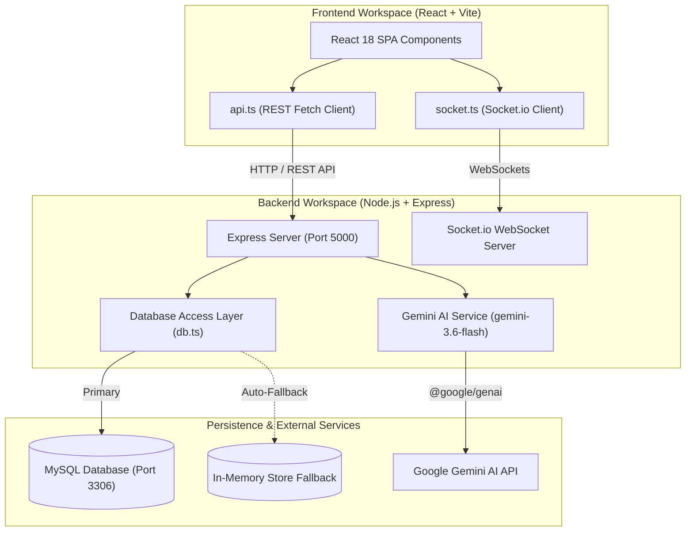

# EduPlay — Complete Full-Stack System & Developer Guide

Welcome to the **EduPlay** developer guide and project documentation. This document serves as the comprehensive manual for the entire EduPlay platform, covering both the **Frontend** (`game/frontend`) and **Backend** (`game-server/backend`).

---

## 📋 Table of Contents

1. [Executive Summary & Product Vision](#1-executive-summary--product-vision)
2. [Full-Stack Architecture & System Flow](#2-full-stack-architecture--system-flow)
3. [Technology Stack](#3-technology-stack)
4. [Project Directory & Workspace Layout](#4-project-directory--workspace-layout)
5. [Core Features & Functional Modules](#5-core-features--functional-modules)
   - [5.1 Games Engine (8 Interactive Games)](#51-games-engine-8-interactive-games)
   - [5.2 Question Set Management & AI Generation](#52-question-set-management--ai-generation)
   - [5.3 Real-Time Multiplayer Lobby System](#53-real-time-multiplayer-lobby-system)
   - [5.4 Free Standalone Teacher Tools](#54-free-standalone-teacher-tools)
   - [5.5 Assignments & Gradebook Analytics](#55-assignments--gradebook-analytics)
   - [5.6 Student Rewards & Sticker Album System](#56-student-rewards--sticker-album-system)
   - [5.7 Pro Tier Monetization & Roles](#57-pro-tier-monetization--roles)
6. [Database Schema & Data Persistence](#6-database-schema--data-persistence)
7. [REST API Specification](#7-rest-api-specification)
8. [Socket.IO WebSockets Protocol](#8-socketio-websockets-protocol)
9. [Step-by-Step Setup & Developer Guide](#9-step-by-step-setup--developer-guide)
10. [Build, Deployment & Troubleshooting](#10-build-deployment--troubleshooting)

---

## 1. Executive Summary & Product Vision

**EduPlay** is a modern, interactive classroom learning platform designed for teachers, speech-language pathologists (SLPs), parents, and K-12 students. 

### Core Architectural Philosophy: Content Decoupling
The foundational principle of EduPlay is **decoupling educational content from game mechanics**. 
- A teacher creates **one Question Set** (e.g., *Grade 3 Multiplication Facts* or *Phonics & Sight Words*).
- That single question set can instantly power **any game** in the EduPlay arcade catalog—from *Wheel Spin* and *Flashcards* to *Alien Spelling*, *Ship Battle*, or *Ocean Quest*.

```
   [ Question Set: Grade 3 Math ]
                 │
  ┌──────────────┼──────────────┬──────────────┐
  ▼              ▼              ▼              ▼
Wheel Spin   Ship Battle  Alien Spelling   Flashcards
```

---

## 2. Full-Stack Architecture & System Flow

EduPlay runs as a two-tier full-stack application with real-time Socket.IO synchronization, REST APIs, AI integration, and flexible data persistence.



---

## 3. Technology Stack

### Frontend Stack (`game/frontend`)
- **Framework**: React 18 with TypeScript 5
- **Build Tool**: Vite 5
- **Styling**: Tailwind CSS v4, Lucide React Icons, `clsx`, `tailwind-merge`
- **Charts & Visuals**: Recharts (Data visualization for student progress), Canvas Confetti
- **Real-Time Client**: `socket.io-client` v4.7
- **AI SDK**: `@google/genai` v2.4

### Backend Stack (`game-server/backend`)
- **Runtime**: Node.js with TypeScript (`tsx` watch mode)
- **Web Server**: Express v4/v5 & HTTP Server
- **Real-Time Engine**: Socket.IO Server v4.8 (CORS enabled)
- **Database Engine**: MySQL2 (Connection Pool) with **built-in zero-config In-Memory Store Fallback**
- **AI Service**: Google GenAI SDK (`@google/genai` - `gemini-3.6-flash`)
- **Environment**: `dotenv` configuration

---

## 4. Project Directory & Workspace Layout

The platform is structured into two separate workspaces for clean separation of concerns:

```
workspace-root/
├── game/                        # Frontend Repository
│   └── frontend/
│       ├── public/              # Static assets and icons
│       ├── src/
│       │   ├── components/      # UI Components by feature domain
│       │   │   ├── assignments/  # Homework & Assignment views
│       │   │   ├── common/       # Navigation, Header, Modal, Cards
│       │   │   ├── dashboard/    # Student & Teacher dashboards
│       │   │   ├── games/        # 8 Arcade Game Implementations + Catalog
│       │   │   ├── home/         # Hero & Marketing Home section
│       │   │   ├── multiplayer/  # Host Lobby & Student Join views
│       │   │   ├── pro-upgrade/  # Pro Pass Upgrade view
│       │   │   ├── question-sets/# Set Creator, Manager & AI Generator
│       │   │   ├── rewards/      # Sticker Album & Ticket redemption
│       │   │   └── teacher-tools/# Name Wheel, Star Chart, Dice, Grouper
│       │   ├── context/          # React Context (AuthContext)
│       │   ├── data/             # Mock data fallback constants
│       │   ├── services/         # api.ts (REST) and socket.ts (Sockets)
│       │   ├── types/            # TypeScript interfaces & domain types
│       │   ├── utils/            # Helper utilities
│       │   ├── App.tsx           # Main application routing & tab router
│       │   ├── main.tsx          # Application entry point
│       │   └── index.css         # Global Tailwind styles
│       ├── package.json
│       ├── server.ts             # Express wrapper for standalone frontend mode
│       └── vite.config.ts        # Vite configuration
│
└── game-server/                 # Backend Repository
    └── backend/
        ├── src/
        │   ├── db.ts             # MySQL pool + In-Memory Fallback engine
        │   ├── seedData.ts       # Initial seed data for users, sets, games
        │   └── server.ts         # Main Express REST server + Socket.IO handlers
        ├── .env                  # Server Environment Configuration
        ├── package.json
        └── tsconfig.json
```

---

## 5. Core Features & Functional Modules

### 5.1 Games Engine (8 Interactive Games)
Located in `frontend/src/components/games/`, each game engine implements a standardized interface accepting a `QuestionSet` and tracking player scores, streaks, and correct/incorrect responses:

1. **Wheel Spin (`WheelSpinGame.tsx`)**: Interactive wheel spin mechanic for points; answer questions correctly to collect points.
2. **Ship Battle (`ShipBattleGame.tsx`)**: Nautical battle where answering correctly fires cannonballs at pirate ships.
3. **Alien Spelling (`AlienSpellingGame.tsx`)**: Built specifically for phonics, articulation, and spelling drills with alien character animations.
4. **Crane Game (`CraneGame.tsx`)**: Claw-machine mechanic where correct answers operate the claw to grab mystery boxes.
5. **Magic Potions (`MagicPotionsGame.tsx`)**: Alchemy brewing game; match answers to brew magical transforming potions.
6. **Flashcards (`FlashcardsGame.tsx`)**: Classic flip-card interface with self-marking, spaced-repetition friendliness, image, and hint support.
7. **Roll & Read (`RollAndReadGame.tsx`)**: Digital dice roller selecting words/questions; optimized for Speech-Language Pathologists (SLPs) and reading groups.
8. **Ocean Quest (`OceanQuestGame.tsx`)**: Underwater dive exploration where answering questions collects sunken treasure.

### 5.2 Question Set Management & AI Generation
Located in `frontend/src/components/question-sets/`:
- **Question Set Editor**: Full CRUD interface to build question sets with title, subject, grade level, tags, hints, and multiple-choice options.
- **AI Question Set Generator**: Powered by Gemini (`gemini-3.6-flash`), allows teachers to enter any topic (e.g. *"Photosynthesis"*, *"Solar System"*, *"4th Grade Fractions"*) and automatically generate structured 5-question sets with hints and options.

### 5.3 Real-Time Multiplayer Lobby System
Located in `frontend/src/components/multiplayer/` and backend `server.ts`:
- **Host Lobby (`HostLobbyView.tsx`)**: Teachers launch a game in multiplayer mode to generate a **4-digit join code**.
- **Student Join (`MultiplayerJoinView.tsx`)**: Students enter the join code and player name to enter the live room via WebSockets.
- **Live Leaderboard**: Real-time score updates streamed across connected clients as players complete questions.

### 5.4 Free Standalone Teacher Tools
Located in `frontend/src/components/teacher-tools/`:
- **Name Wheel**: Animated random student picker for classroom call-outs.
- **Star Chart**: Interactive behavioral reward chart with star counters per student.
- **Student Grouper**: Random team/group generator based on custom roster sizes.
- **Virtual Dice**: 3D-styled animated dice randomizer.
- **Behavior Race**: Visual race track where student avatars advance as positive reinforcement.

### 5.5 Assignments & Gradebook Analytics
Located in `frontend/src/components/assignments/` and `progress/`:
- Teachers create assignments with due dates and unique join codes (`FUN-XXXX`).
- Analytics dashboard tracks completion rates, average accuracy %, score breakdown per student, and weak topic diagnostic metrics via Recharts.

### 5.6 Student Rewards & Sticker Album System
Located in `frontend/src/components/rewards/`:
- Students earn **Points** from playing assigned games.
- Every **250 Points** unlocks **1 Ticket**.
- Tickets are redeemed in the **Sticker Album** to unlock collectible stickers across four rarity tiers (*Common*, *Rare*, *Epic*, *Legendary*).

### 5.7 Pro Tier Monetization & Roles
- **User Roles**: `teacher`, `student`, `parent`, `admin`, `guest`.
- **Pro Tier**: A single teacher Pro Pass unlocks exclusive game mechanics, advanced AI features, and sticker rewards toggles across all linked student assignments.

---

## 6. Database Schema & Data Persistence

The backend utilizes `db.ts` which connects to **MySQL**. If MySQL is unreachable, the system **automatically falls back to an In-Memory Store** seeded from `seedData.ts`, enabling instant development without database setup.

```mermaid
erdiagram
    USERS ||--o{ QUESTION_SETS : creates
    USERS ||--o{ ASSIGNMENTS : assigns
    USERS ||--o{ ATTEMPTS : performs
    USERS ||--o| REWARDS : earns
    QUESTION_SETS ||--|{ QUESTIONS : contains
    QUESTION_SETS ||--o{ ASSIGNMENTS : references
    ASSIGNMENTS ||--o{ ATTEMPTS : generates
    ATTEMPTS ||--|{ ATTEMPT_ANSWERS : contains
```

### Table Definitions

1. **`users`**: `id`, `name`, `email`, `role`, `is_pro`, `avatar_url`, `class_name`
2. **`games`**: `id`, `name`, `slug`, `description`, `mechanic`, `badge`, `category`, `min_grade`, `icon_name`, `gradient_bg`, `accent_color`, `image_url`
3. **`question_sets`**: `id`, `owner_id`, `owner_name`, `title`, `description`, `subject`, `grade_level`, `is_public`, `tags` (JSON), `created_at`, `updated_at`
4. **`questions`**: `id`, `set_id`, `prompt_text`, `answer`, `options` (JSON), `type`, `position`, `hint`
5. **`assignments`**: `id`, `teacher_id`, `teacher_name`, `class_id`, `class_name`, `question_set_id`, `question_set_title`, `game_slug`, `game_name`, `join_code`, `due_date`, `rewards_enabled`, `created_at`
6. **`attempts`**: `id`, `assignment_id`, `student_id`, `student_name`, `question_set_id`, `question_set_title`, `game_slug`, `score`, `accuracy`, `total_questions`, `correct_count`, `completed_at`
7. **`attempt_answers`**: `id`, `attempt_id`, `question_id`, `question_prompt`, `student_answer`, `correct_answer`, `is_correct`
8. **`stickers`**: `id`, `name`, `rarity`, `category`, `emoji`, `description`
9. **`roster`**: `id`, `name`, `avatar`, `stars`, `points`
10. **`rewards`**: `student_id`, `points`, `tickets_earned`, `unlocked_sticker_ids` (JSON)

---

## 7. REST API Specification

Base URL: `http://localhost:5000/api`

| Method | Endpoint | Description | Request Body / Parameters |
|---|---|---|---|
| `GET` | `/api/health` | Backend status & DB connection state | N/A |
| `GET` | `/api/users` | List all system users | N/A |
| `PUT` | `/api/users/:id` | Update user profile / toggle Pro status | `{ isPro, name, email, avatarUrl }` |
| `GET` | `/api/games` | Fetch catalog of games | N/A |
| `GET` | `/api/question-sets` | Fetch all question sets with nested questions | N/A |
| `POST` | `/api/question-sets` | Create or update a question set | `QuestionSet` object |
| `DELETE` | `/api/question-sets/:id` | Delete a question set by ID | N/A |
| `GET` | `/api/assignments` | Fetch active teacher assignments | N/A |
| `POST` | `/api/assignments` | Create a new assignment with join code | `Assignment` object |
| `DELETE` | `/api/assignments/:id` | Delete an assignment | N/A |
| `GET` | `/api/attempts` | Fetch student game completion attempts | N/A |
| `POST` | `/api/attempts` | Submit student attempt & calculate rewards | `Attempt` object with `answers[]` |
| `GET` | `/api/stickers` | Fetch full catalog of unlockable stickers | N/A |
| `GET` | `/api/roster` | Fetch classroom roster list | N/A |
| `POST` | `/api/roster` | Add student to class roster | `{ name, avatar }` |
| `PUT` | `/api/roster/:id` | Update student stars or points | `{ name, avatar, stars, points }` |
| `DELETE` | `/api/roster/:id` | Remove student from roster | N/A |
| `GET` | `/api/rewards/:studentId` | Get student rewards, points & sticker IDs | N/A |
| `PUT` | `/api/rewards/:studentId` | Update unlocked stickers or points | `{ points, ticketsEarned, unlockedStickerIds }` |
| `POST` | `/api/ai/generate-set` | Generate question set using Gemini AI | `{ topic, gradeLevel, count, subject }` |

---

## 8. Socket.IO WebSockets Protocol

Real-time communication for multiplayer game rooms operates on standard Socket.IO events:

### Client Emit Events
- `create_lobby`: Host initializes a room (`{ gameSlug, questionSetId, hostName }`)
- `join_lobby`: Student enters room (`{ code, playerName, avatar }`)
- `start_game`: Host starts game for room (`{ code }`)
- `update_score`: Player submits points (`{ code, scoreDelta }`)

### Server Broadcast Events
- `lobby_updated`: Emitted when players join/leave or score updates (`{ room }`)
- `game_started`: Emitted when host launches game session (`{ room }`)

---

## 9. Step-by-Step Setup & Developer Guide

### 9.1 Prerequisites
- **Node.js**: v18.0.0 or higher
- **npm** (v9+) or **bun**
- (Optional) **MySQL Database**: v8.0+
- (Optional) **Google Gemini API Key**: For AI question set generation

---

### 9.2 Environment Configuration

1. **Backend Environment**: Create or verify `game-server/backend/.env`:
   ```env
   PORT=5000
   DB_HOST=localhost
   DB_PORT=3306
   DB_USER=games
   DB_PASSWORD=games
   DB_NAME=games
   GEMINI_API_KEY=your_gemini_api_key_here
   ```

2. **Frontend Environment**: Create or verify `game/frontend/.env.local`:
   ```env
   VITE_API_URL=http://localhost:5000
   GEMINI_API_KEY=your_gemini_api_key_here
   ```

---

### 9.3 Launching the Application

#### Step 1: Start the Backend Server
```bash
# Navigate to backend folder
cd c:\Users\james\Documents\game-server\backend

# Install dependencies (if first time)
npm install

# Start backend dev server with hot reload
npm run dev
```
*Expected Output:*
```
🚀 EduPlay Backend Server with Socket.IO listening on http://0.0.0.0:5000
```
*(Note: If MySQL is not running locally, the server automatically outputs `⚠️ MySQL query error, using in-memory store fallback` and continues running smoothly!)*

---

#### Step 2: Start the Frontend Application
Open a new terminal window:
```bash
# Navigate to frontend folder
cd c:\Users\james\Documents\game\frontend

# Install dependencies (if first time)
npm install

# Start Vite development server
npm run dev
```
*Expected Output:*
```
  VITE v5.2.11  ready in 300 ms

  ➜  Local:   http://localhost:5173/
  ➜  Network: use --host to expose
```

Open your browser and navigate to `http://localhost:5173`.

---

## 10. Build, Deployment & Troubleshooting

### Building for Production

1. **Frontend Production Build**:
   ```bash
   cd c:\Users\james\Documents\game\frontend
   npm run build
   ```
   Outputs production bundle to `dist/`.

2. **Backend Production Build**:
   ```bash
   cd c:\Users\james\Documents\game-server\backend
   npm run build
   npm start
   ```

---

### Frequently Asked Questions & Troubleshooting

#### Q1: Do I need to set up MySQL to run the project?
**No.** The backend includes an automated in-memory persistence layer (`db.ts`). If MySQL is offline or unconfigured, all endpoints operate seamlessly using memory arrays initialized from `seedData.ts`.

#### Q2: Why is AI Question Generation returning fallback data?
Ensure that `GEMINI_API_KEY` is provided in `backend/.env` or `frontend/.env.local`. If absent, the backend safely catches the 503 response and provides pre-built mock sets so the UI never crashes.

#### Q3: How do I test real-time multiplayer locally?
1. Log in as a Teacher, navigate to **Question Sets**, choose a set, and click **Host Multiplayer**.
2. Note the generated 4-digit room code (e.g. `4812`).
3. Open an Incognito/Private window at `http://localhost:5173`, click **Join Game**, enter the room code, and pick an avatar.
4. Watch the student appear live on the teacher's host screen in real-time!

---
*Created for EduPlay — The Interactive Learning & Classroom Management Platform.*
